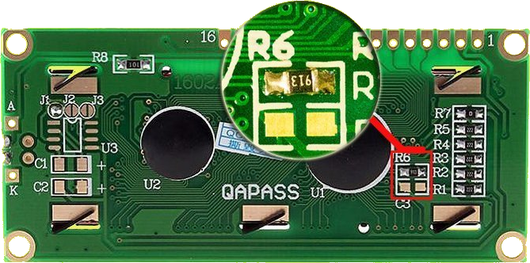
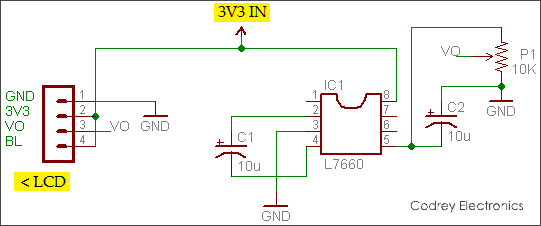

# LCD1602A

## Придбання

Зараз більшість популярних мікроконтролерів працюють на `3,3В`, але багато рідкокристалічних дисплеїв `LCD` для них зазвичай працюють на `5В`, оскільки вони зосереджені на де-факто стандартному `LCD`-контролері `Hitachi` – мікросхемі `HD44780`. Тут представлений простий, але ефективний трюк для перетворення стандартного `LCD`-дисплея `5В` на `3,3В`!

Як ви можете бачити на наступному фото, деякі `LCD`-модулі мають на задній стороні не зайняті місця для монтажу перетворювача напруги з комутаційним конденсатором, наприклад `L7660` або `MAX660`. Якщо у вас така ж друкована плата `LCD`, просто додайте одну мікросхему `MAX660` (`U3`) і два конденсатори по 10 мкФ (`C1`-`C2`), щоб завершити перетвоерення. Однак не забудьте відкрити перемичку `J1` і закрити `J3`. Це все.

<!-- 
Ця невелика модифікація додає перетворювач накачки негативного заряду для подачі негативної контрастної напруги (V0) близько 2,5 В на електроніку дисплея. Цей прийом необхідний, оскільки символи на згаданому тут рідкокристалічному дисплеї стають видимими лише тоді, коли VDD-V0 ≥ 5 В, де VDD — робоча напруга, а V0 — контрастна напруга РК-дисплея. Наша проста математика дає вихідне значення V0 ≈ -2 В, добре для належної роботи РК-дисплея при напрузі 3,3 В. Зверніть увагу, тут лампа підсвічування також працює на 3,3 В, її яскравість трохи нижче. Це можна виправити, якщо необхідно змінити значення вбудованого резистора обмежувача струму (R8).

Ще одна проблема, яка викликає занепокоєння (часто при взаємодії з швидкими мікроконтролерами), — частота генератора електроніки РК-дисплея, тобто. коли напруга живлення знижується (від 5 В до 3,3 В), частота вбудованого тактового генератора також падає. Rosc слід змінити на відповідне значення (від типового 91 кОм – див. наступний малюнок) для 3,3 В, якщо подовження часу виконання команди не прийнятне.

Покажчик LCD-Rosc від 5 В до 3 В3

Навіть якщо ваш РК-дисплей іншого типу, тобто без вільних контактних площадок, ви все одно можете перетворити його на тип 3,3 В за допомогою мікросхеми L7660. Для цього просто побудуйте наступну схему на невеликій платі veroboard (або спеціалізованій друкованій платі) і ретельно підключіть її до свого РК-дисплея 5 В. Однак ваш 5-вольтовий РК-дисплей має бути типу з контролером HD44780 (або сумісним) у його основі. Потенціометр (P1) у даній схемі призначений для регулювання рівня контрастності дисплея.

Ілюстрація друкованої плати адаптера, наведена тут, призначена для швидкої довідки зацікавлених домашніх виробників друкованих плат. У всякому разі, це не масштабоване зображення; фактичний розмір друкованої плати ~ 17,78 x 30,48 мм! -->

